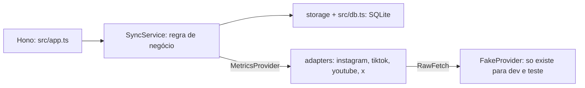

# Conty: métricas das redes do criador

Serviço que recebe uma conexão já autorizada (o token pode ser fictício) e sincroniza as métricas dos posts de Instagram, TikTok, YouTube e X. Sobrevive a timeout, resposta duplicada e rate limit do provedor, e não conta o mesmo post duas vezes, mesmo com janelas que se sobrepõem.

Não há OAuth real e não há chamada de rede real. O provedor é um fake com dados de demonstração.

## Como rodar

Node 22 ou mais novo (testado no 24).

```
npm install
npm run dev        # http://localhost:3000, provedor fake já populado
npm test
npm run typecheck
```

`PORT`, `DB_PATH` (padrão `:memory:`), `SYNC_MAX_ATTEMPTS`, `SYNC_REQUEST_TIMEOUT_MS` e `SYNC_MAX_RETRY_AFTER_MS` mudam o comportamento do servidor de desenvolvimento.

## Arquitetura



- `src/domain/sync-service.ts` guarda toda a regra: janela, paginação, retry, 429, idempotência. Não conhece nome de campo de plataforma.
- `src/providers/adapters/*` traduzem o formato cru de cada plataforma (`play_count`, `viewCount`, `public_metrics.impression_count`, ...) para `PostMetrics`. O formato cru não passa dessa camada. Todo erro sai como `ProviderError` com um `kind` (`timeout`, `server`, `rate_limited`, `unauthorized`, ...).
- `src/providers/fake/*` é o provedor falso. Ele fala o formato cru de cada plataforma, então os adapters são exercitados de verdade. Cada chamada pode ser roteirizada: página normal, timeout, travar, 5xx, 429 com `Retry-After`, payload torto, página repetida.
- `src/db.ts` é o único arquivo que importa `node:sqlite`.
- `Clock` e `Sleeper` são injetados. Nos testes o sleeper só registra a espera e adianta o relógio falso: nenhum teste espera de verdade.

## Idempotência

As métricas dos provedores são contadores absolutos ("este vídeo tem 1200 views agora"), então somar sincronizações está errado por definição. O modelo:

- `posts` tem `UNIQUE (connection_id, platform_post_id)`. Ver o mesmo post de novo só atualiza `last_seen_at`.
- `snapshots` é append-only (triggers bloqueiam UPDATE e DELETE) com `UNIQUE (post_id, provider_observed_at)`. Cada linha guarda `fetched_at` (nosso relógio) e `provider_observed_at` (relógio do provedor).
- O valor atual de um post é o último snapshot por tempo do provedor (view `current_metrics`). Nunca é soma. Totais por criador somam o valor atual de posts distintos.
- Cada página é gravada numa transação, junto com o contador e o cursor do run. Uma página que falha no meio não deixa nada.

Exemplo com janelas sobrepostas, como nos testes. Posts publicados nos dias 3, 6, 10, 14, 18 e 22, com 100 a 600 views:

| sync | janela | posts vistos | snapshots novos | duplicados ignorados | total de views |
|---|---|---|---|---|---|
| A | 01 a 16 | p1 a p4 | 4 | 0 | 1000 |
| B | 09 a 25 | p3 a p6 | 2 | 2 | 2100 |
| B de novo | 09 a 25 | p3 a p6 | 0 | 4 | 2100 |

O total é 2100, o mesmo de uma janela única de 01 a 30. A mesma página enviada duas vezes, ou o mesmo item duas vezes na mesma página, cai na mesma regra.

Casos de borda:

- **Snapshot mais antigo chegando depois** fica no histórico, mas não vira o atual. O atual é decidido pelo tempo do provedor, não pela ordem de chegada.
- **Mesmo `provider_observed_at` com números diferentes**: vale o primeiro. O timestamp é a versão do dado no provedor; dois valores para a mesma versão é um provedor incoerente, e não escolho o segundo só por ter chegado depois.
- **Provedor sem timestamp** (YouTube e X no fake): `provider_observed_at` fica `NULL` e o tempo efetivo é o `fetched_at`. Como o SQLite trata `NULL` como distinto, a constraint não protege esse caso. A regra, dentro da transação da página: se os contadores são idênticos ao último snapshot, é duplicado. Eu preferi isso a um hash único por post porque contadores podem voltar a um valor antigo (5 likes, 6, 5 de novo) e um hash único descartaria o último. O custo: sem timestamp não dá para detectar página velha reenviada.
- **Timestamp no futuro** (mais de 5 minutos à frente do nosso relógio) reprova a página inteira. Um valor futuro ficaria como "último" para sempre e congelaria o post.
- **Contador negativo, fracionário ou texto** no payload: a página falha com `invalid_payload`, sem retry e sem gravar nada.
- **Dois syncs ao mesmo tempo na mesma conexão**: o segundo recebe 409 (índice único parcial em `sync_runs` onde `status = 'running'`). Um run que ficou `running` por queda do processo é marcado `failed` (`interrupted`) na subida.
- **A janela é `[from, to)`**: um post publicado exatamente em `to` entra na próxima janela.

## Retry, timeout e 429

Configuração (`src/config.ts`):

| item | padrão |
|---|---|
| tentativas por execução (todas as causas somadas) | 5 |
| timeout por requisição (`AbortSignal.timeout`) | 10 s |
| backoff após falha transitória | 500 ms x 2^(n-1), teto 8 s, jitter de até -20% |
| teto de espera por `Retry-After` | 60 s |
| páginas por run | 200 |

- **Timeout, erro de rede, 5xx, 408**: espera o backoff e tenta de novo a mesma página. Ao esgotar as 5 tentativas o run termina `failed` com `attempts = 5`. Esperas com os padrões e sem jitter: 0,5 s, 1 s, 2 s, 4 s.
- **429 com `Retry-After`** (segundos ou data HTTP): espera exatamente esse tempo, pelo `Sleeper` injetado, e tenta de novo. Data no passado vale como "agora".
- **429 com `Retry-After` acima do teto**: não espera. O run termina `rate_limited` com `retry_at` gravado e o `next_cursor` da última página concluída. Um agendador chama `POST /sync-runs/:id/resume` quando chegar `retry_at`; antes disso a resposta é 409 `too_early`. Uma espera nunca passa de `maxRetryAfterMs`.
- **429 sem `Retry-After` válido**: usa o backoff.
- **429 em todas as tentativas**: no teto de tentativas o run termina `rate_limited` com `retry_at`, sem esperar de novo.
- **401**: falha na hora, sem retry, e a conexão vira `needs_reauth`. Novos syncs respondem 409 até `POST /connections` ser chamado de novo com o mesmo `account_id` e um token novo.
- **Outros 4xx**: falha na hora (`rejected`), sem marcar a conexão. 403 cai aqui de propósito: no YouTube ele também significa cota, e não quero revogar a conexão por isso.
- **Retomada**: um retry repete só a página que falhou. Páginas anteriores não são buscadas de novo, nem dentro do run nem no `resume`.
- **Cursor repetido** ou mais de 200 páginas: o run falha (`cursor_loop`, `too_many_pages`).

O teto de tentativas vale por execução (`sync` ou `resume`). O `POST /connections/:id/sync` espera o run terminar; no pior caso, com 429 abaixo do teto, são 4 esperas de 60 s. Use `?async=true` para receber 202 na hora e acompanhar por `GET /sync-runs/:id`.

## Onde ver quando a métrica foi buscada

- `GET /connections/:id/posts`: cada post traz `fetched_at` (quando buscamos o valor atual), `provider_observed_at` (quando o provedor diz que ele valia, `null` se não informa) e `last_checked_at` (a última vez que um sync viu o post, mesmo sem mudança).
- `GET /posts/:id/snapshots`: histórico completo.
- `GET /creators/:id/metrics`: totais, `oldest_fetched_at` e `newest_fetched_at` dos valores usados, e `last_successful_sync_at` por conexão. Uma conexão em `needs_reauth` aparece com esse status, então um total velho não passa por atual.
- `GET /sync-runs/:id`: janela, status, `attempts`, `pages`, `posts_upserted`, `snapshots_inserted`, `duplicates_skipped`, `retry_at`, erro, `started_at`, `finished_at`.

## Exemplos (executados no servidor de desenvolvimento)

O servidor de desenvolvimento tem contas e tokens de demonstração: `ig_ana`, `tt_ana`, `yt_ana`, `x_ana` com 8 posts cada em setembro de 2026, e os tokens `demo-token` (normal), `demo-flaky` (primeiro pedido responde 429 com `Retry-After: 2`), `demo-ratelimited` (sempre 429 com `Retry-After: 3600`) e `demo-revoked` (sempre 401). Saídas abaixo foram truncadas apenas onde indicado.

Criar conexão. O token não volta na resposta:

```
curl -s -X POST localhost:3000/connections -H 'content-type: application/json' \
  -d '{"creator_id":"ana","platform":"instagram","account_id":"ig_ana","access_token":"demo-token"}'
```
```json
{
  "id": "con_b52db94e-08f4-4294-8ccf-ef2c83f7877d",
  "creator_id": "ana",
  "platform": "instagram",
  "account_id": "ig_ana",
  "status": "active",
  "created_at": "2026-10-09T15:32:09.973Z",
  "updated_at": "2026-10-09T15:32:09.973Z",
  "last_successful_sync_at": null
}
```

Duas janelas que se sobrepõem (posts dos dias 11 e 14 aparecem nas duas):

```
curl -s -X POST localhost:3000/connections/$ID/sync -H 'content-type: application/json' \
  -d '{"from":"2026-09-01","to":"2026-09-16"}'
curl -s -X POST localhost:3000/connections/$ID/sync -H 'content-type: application/json' \
  -d '{"from":"2026-09-09","to":"2026-09-26"}'
```
```json
{
  "id": "run_bd3680f8-ebc5-4259-8244-13ba79249232",
  "status": "succeeded",
  "window_from": "2026-09-01T00:00:00.000Z",
  "window_to": "2026-09-16T00:00:00.000Z",
  "attempts": 2,
  "pages": 2,
  "posts_upserted": 5,
  "snapshots_inserted": 5,
  "duplicates_skipped": 0,
  "started_at": "2026-10-09T15:32:15.133Z",
  "finished_at": "2026-10-09T15:32:15.141Z"
}
{
  "id": "run_bb11e06e-85e6-4eac-92b7-6e34214d84a5",
  "status": "succeeded",
  "window_from": "2026-09-09T00:00:00.000Z",
  "window_to": "2026-09-26T00:00:00.000Z",
  "attempts": 2,
  "pages": 2,
  "posts_upserted": 5,
  "snapshots_inserted": 3,
  "duplicates_skipped": 2,
  "started_at": "2026-10-09T15:32:15.183Z",
  "finished_at": "2026-10-09T15:32:15.183Z"
}
```

(Campos `connection_id`, `next_cursor`, `retry_at`, `error_code` e `error` omitidos aqui; a API os devolve.) Os dois posts repetidos foram ignorados. Os posts, com `fetched_at` por item, o primeiro de oito:

```
curl -s localhost:3000/connections/$ID/posts
```
```json
{
  "connection_id": "con_b52db94e-08f4-4294-8ccf-ef2c83f7877d",
  "platform": "instagram",
  "connection_status": "active",
  "posts": [
    {
      "id": "pst_7bc27498-ce45-4dcd-8eaf-df844c500a6a",
      "platform_post_id": "ig23",
      "url": null,
      "published_at": "2026-09-23T12:00:00.000Z",
      "metrics": { "views": 36000, "likes": 3000, "comments": 400, "shares": 240 },
      "provider_observed_at": "2026-10-08T23:00:00.000Z",
      "fetched_at": "2026-10-09T15:32:15.183Z",
      "last_checked_at": "2026-10-09T15:32:15.183Z"
    }
  ]
}
```

O post `ig14` está nas duas janelas: `fetched_at` continua `15:32:15.141Z` (primeiro sync) e só o `last_checked_at` andou para `15:32:15.183Z`. Totais do criador, com 8 posts distintos:

```
curl -s localhost:3000/creators/ana/metrics
```
```json
{
  "creator_id": "ana",
  "posts": 8,
  "totals": { "views": 176000, "likes": 14667, "comments": 1956, "shares": 1173 },
  "oldest_fetched_at": "2026-10-09T15:32:15.141Z",
  "newest_fetched_at": "2026-10-09T15:32:15.183Z",
  "connections": [
    {
      "connection_id": "con_b52db94e-08f4-4294-8ccf-ef2c83f7877d",
      "platform": "instagram",
      "status": "active",
      "last_successful_sync_at": "2026-10-09T15:32:15.183Z",
      "posts": 8, "views": 176000, "likes": 14667, "comments": 1956, "shares": 1173
    }
  ]
}
```

429 com `Retry-After: 2` (conexão TikTok com `demo-flaky`). O comando levou 2,05 s: a espera foi de 2 s e `attempts` é 3 (429, página 1, página 2):

```json
{
  "id": "run_c909431d-2772-4592-834e-ea7951137bc0",
  "status": "succeeded",
  "attempts": 3,
  "pages": 2,
  "snapshots_inserted": 5,
  "started_at": "2026-10-09T15:32:24.701Z",
  "finished_at": "2026-10-09T15:32:26.715Z"
}
```

429 com `Retry-After: 3600` (acima do teto de 60 s; YouTube com `demo-ratelimited`). Não esperou, voltou na hora:

```json
{
  "id": "run_beb057be-6791-43b0-aa4d-cd4c578c6f8c",
  "status": "rate_limited",
  "attempts": 1,
  "pages": 0,
  "retry_at": "2026-10-09T16:32:26.757Z",
  "error_code": "rate_limited",
  "error": "provider rate limit (429); Retry-After 3600000ms is above the 60000ms ceiling",
  "started_at": "2026-10-09T15:32:26.757Z",
  "finished_at": "2026-10-09T15:32:26.757Z"
}
```
```
curl -s -X POST localhost:3000/sync-runs/run_beb057be-6791-43b0-aa4d-cd4c578c6f8c/resume   # antes de retry_at
HTTP 409  {"error":{"code":"too_early","message":"the provider asked to wait until retry_at","retry_at":"2026-10-09T16:32:26.757Z"}}
```

401 (X com `demo-revoked`): falha na hora, a conexão vira `needs_reauth` e o sync seguinte é recusado:

```json
{ "id": "run_cd64777c-c05e-4d7b-936e-1e5a3bb0b431", "status": "failed", "attempts": 1, "error_code": "unauthorized", "error": "provider rejected the access token (401)" }
{ "error": { "code": "needs_reauth", "message": "the connection token was rejected; reconnect before syncing" } }
```

## O que ficou de fora

- Cliente HTTP real para as APIs das plataformas. A fronteira é `RawFetch`; trocar o fake por `fetch` com URL base é a próxima peça.
- Agendador. `retry_at` e `resume` existem para ele, mas nada chama `resume` sozinho.
- Autenticação e autorização da própria API, e criptografia do token em repouso (hoje fica em texto no SQLite).
- Mais de um processo. A garantia "um run por conexão" vale por índice no banco, mas a regra de snapshot sem timestamp assume uma transação por vez, o que o SQLite com `BEGIN IMMEDIATE` já dá.
- Agregados por campanha: só por criador. Campanha precisaria do vínculo post-campanha, que não está no escopo.
- `Retry-After` nos formatos antigos de data (RFC 850, asctime): só o formato IMF-fixdate é lido; o resto cai no backoff.
- Migrações: o esquema é criado com `CREATE ... IF NOT EXISTS` na abertura.

## Testes

`npm test` roda 66 testes do vitest, sem espera real (relógio e sleeper falsos, exceto um teste que usa um timeout real de 25 ms para provar que o `AbortSignal` está ligado).

- `test/idempotency.test.ts`: janelas sobrepostas, mesma página duas vezes, item duplicado na página, snapshot mais velho depois do novo, sem timestamp, constraints do banco, página atômica.
- `test/retry.test.ts`: timeout seguido de sucesso, 5xx esgotando em 5 tentativas, 429 com 30 s esperando exatamente 30 s, data HTTP, 429 acima do teto sem espera e com `retry_at`, no teto exato, teto de tentativas compartilhado, 401, retomada pelo cursor, cursor repetido.
- `test/adapters.test.ts`: o formato de cada plataforma vira o mesmo `PostMetrics`; parse de `Retry-After`.
- `test/http.test.ts`: rotas, validação, `fetched_at` visível, 409 de sync concorrente, reconexão depois de `needs_reauth`.

## Uso de IA

Escrevi o código e os testes com um assistente de código com IA (Claude), que eu dirigi. O que eu revisei e ajustei:

- Para provedores sem timestamp, não usei hash único por post e fiz a comparação com o último snapshot. O hash descartaria um contador que volta a um valor antigo (5, 6, 5 likes), e escrevi um teste para esse caso.
- Conferi que o teto do `Retry-After` vale na fronteira: 60 s espera, 61 s não espera e grava `retry_at`. Quebrei a comparação de propósito para ver os testes falharem.
- Fiz o 403 não revogar a conexão, porque no YouTube ele também é cota. Só 401 marca `needs_reauth`.
- Fiz o contador `posts_upserted` ser calculado no banco, em vez de em memória, para continuar correto depois de um `resume`.
